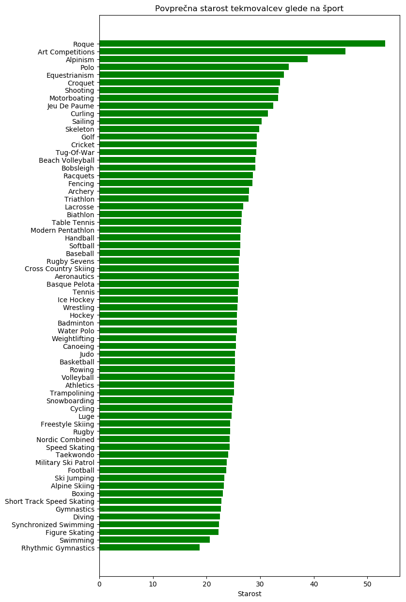
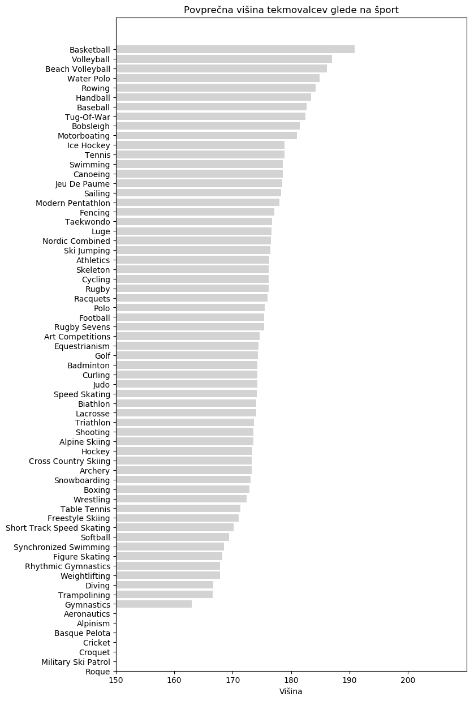
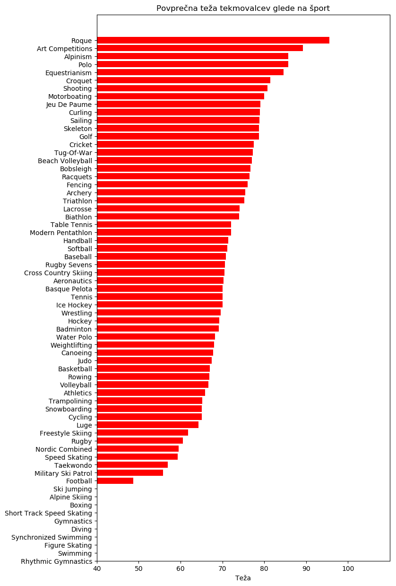

# Analiza zadnjih 120 let olimpijskih iger
## Podatkovno rudarjenje (PR)
#### Univerza v Ljubljani
#### Fakulteta za računalništvo in informatiko
 

##### Skupina:
 - Žiga Šolar	(zs3653@student.uni-lj.si)
 - Andraž Simčič (as7495@student.uni-lj.si)
 - Simon Klemenčič (sk0019@student.uni-lj.si)
 - Nejc Kozjek (nk4370@student.uni-lj.si)
 
 

### Vmesno Poročilo

##### Opis Problema

Naloga, ki si jo je zadala naša skupina, je analiza in obdelava podatkov zimskih in poletnih Olimpiskijh iger zadnjih 120 let. Iz podanih podatkov smo skušali z metodami podatkovnega rudarjenja in strojnega učenja pridobiti boljši vpogled v rezultate Olimpijskih iger in karakteristike športnikov ter držav, ki jih le ti zastopajo. Izdelati želimo tudi animacijo uspešnosti držav po letih (vse medalje - zlate, srebrne in bronaste). Prav tako želimo narediti model, s katerim bi lahko napovedali verjetnost zmag držav glede na posamezne športe, pa tudi napovedati uspeh posameznega športnika glede na njegove telesne karakteristike. Za konec bomo tudi poizkusili napovedati, kateri šport bi bil najbolj primeren za posameznega športnika, glede na njegove telesne karakteristike.

##### Podatki

Podatkovno zbirko smo pridobili iz spletnega portala Kaggle (https://www.kaggle.com/heesoo37/120-years-of-olympic-history-athletes-and-results/version/2), kjer so podatki na razpolago v formatu "csv". V podatkih imamo 270 000 vrstic podatkov.

Podatki so v dveh tabelah. Prva tabela vsebuje 15 atributov, ki nam povedo športnikovo polno ime, spol, starost, višino, težo, ekipo, državo zastopanja, šport, dogodek, letnico, naziv, sezona, mesto poteka olimpijskih iger in status ali je prejel medaljo. Druga tabela vsebuje kratico in naziv države ter opombo.

Za boljši pregled podatkov smo se odločii, da bomo združili tabeli v eno preko atributa kratice države (NOC).

##### Izvedene analize
###### Analiza povprečnih starosti športnikov glede na šport

Analiza je pokazala zanimiv rezultat, saj so pri določenih športih na Olimpijskih igrah tekmovali tudi starejši športniki, vendar predvsem v športih, ki v sodobnem času niso več del iger. Izstopa kriket (Roque), kjer je bila povprečna starost tekmovalcev kar 53,3 let. Najmanjša povprečna starost tekmovalcev pa je v ritmični gimnastiki in sicer 18,74 let. Podrobnosti povprečnih starosti drugih športov so prikazane v grafu.

###### Analiza povprečnih višin športnikov glede na šport

Ta analiza je prikazala pričakovan rezultat, da se najvišji športniki ukvarjajo s košarko. Njihova povprečna višina je kar 190,9 cm. Med višje športnike sodijo tudi tisti, ki se ukvarjajo z odbojko, vaterpolom, veslanjem in rokometom. Najnižji športniki so tisti, ki se ukvarjajo z gimnastiko, trampolinom ali potapljanjem. Druge podrobnosti so razvidne iz grafa, pri čemer za nekatere športe ni bilo podatkov.

###### Analiza povprečne teže športnikov glede na šport

Tudi pri tej analizi so bili najtežji športniki tisti, ki so se ukvarjali s kriketom (Roque). Ta šport ni več prisoten na Olimpijskih igrah. Najlažji športniki na grafu so presenetljivo nogometaši, vendar smo z dodatno analizo ugotovili, da je podatek pri enem od nogometašev zagotovo napačen (pri 183 cm višine ima vpisanih le 28 kg), kar nekaj pa je vpisanih tudi ženskih nogometašic, ki tehtajo manj kot 50 kg. Druge podrobnosti so razvidne iz grafa, pri čemer za nekatere športe ni bilo podatkov.

###### Analiza najuspešnejših držav glede na število medalj

V tej analizi so upoštevane vse medalje, ne glede na barvo. Najuspešnejše so Združene države Amerike s 5219 osvojenimi medaljami. V tabeli je izpisanih najuspešnejših 10 držav, poleg njih pa še Slovenija s svojimi 48 medaljami. Podrobnosti so razvidne iz tabele.
